# Deploying kubernetes

## 1. Deploying Kubernetes single and multi-node

Para todos los casos que se van a mostrar a continuación se estará utilizando un deployment del cluster con el driver 'docker' donde cada nodo está corriendo sobre un container tal como se mostrará en las siguientes secciones.
### 1.1 Creación de cluster Kubernetes local con un único nodo

* Creación de cluster

```
$ minikube start
```

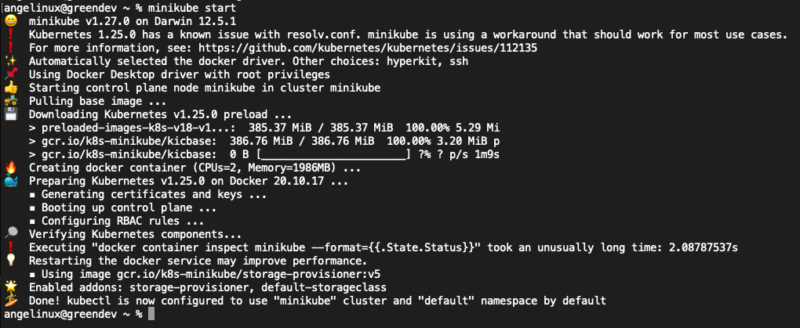

* Podemos ver la información del cluster single-node y del con los comandos

```
$ kubectl cluster-info
$ kubectl get nodes -o wide
```

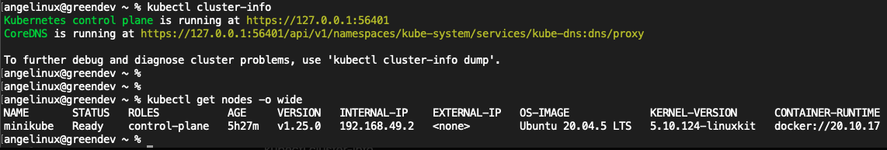

* Adicionalmente, podemos ver los POD's desplegados por defecto

```
$ kubectl get pods -A
```

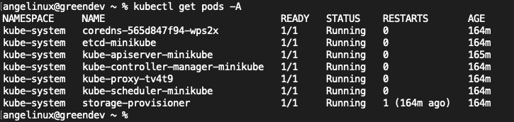

### 1.2 Creación de cluster Kubernetes local multi-nodo

* Para la creación del cluster multi-node especificamos un cluster de 2 nodos llamado 'multinode-demo' con el comando

```
minikube start --nodes 2 -p multinode-demo
```

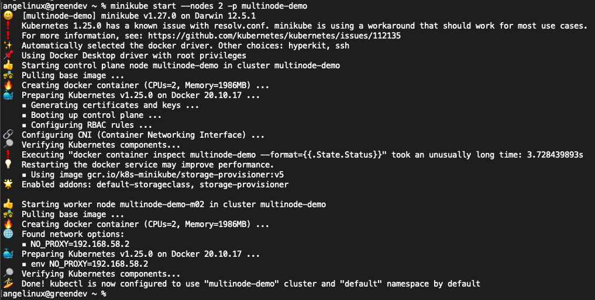

Podemos listar los cluster existentes con el comando

```
minikube profile list
```

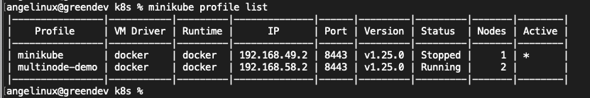

* De forma similar podemos listar los nodos del cluster y apreciar los 2 nodos desplegados.

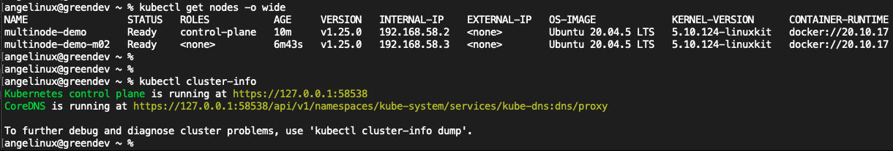

* En esta ocasión si listamos los POD's del cluster se puede ver como algunos de estos están desplegados en el segundo nodo del cluster

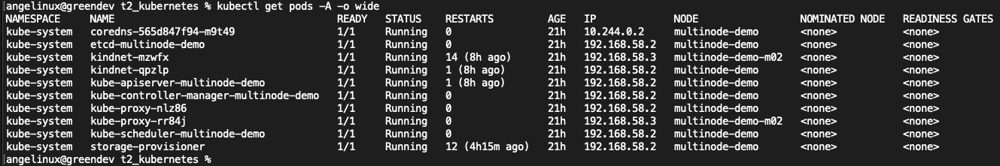

## 2. A Containerized application
### Funcionalidad
La funcionalidad de la aplicación es recibir un HTTP request y retornar el nombre del host (hostmane) y la dirección
IP (IP) de la máquina o contenedor que está recibiendo y procesando el HTTP request.

### Finalidad
Esta funcionalidad es de gran ayuda cuando se utilizan múltiples nodos en una aplicación, ya que se puede visualizar
el balanceo de carga entre los 'n' nodos que tenga el clúster de la aplicación. Esto debido a que cada vez que se
envíe un request a la aplicación, esta responderá desde cualquiera de los nodos, permitiendo diferenciar en qué nodo
se está procesando el request, ya que la respuesta cambiará dependiendo del nodo que responda.

### Referencias
#### GitHub
La implementación de la aplicación se encuentra en el siguiente repositorio de GitHub:

[pbitty/hello-from: A simple HTTP service that responds with its hostname and IP addresses](https://github.com/pbitty/hello-from)

#### DockerHub
La imagen de la aplicación se encuentra en el siguiente repositorio de DockerHub:

[pbitty/hello-from:latest | Docker Hub](https://hub.docker.com/layers/pbitty/hello-from/latest/images/sha256-815b60bcc226e5e8c43f5d97f778238cd96937e1e0b34da00881b3881cbfbd08?context=explore)

## 3. Deployment a containerized application on Kubernetes
### 3.1 Despliegue de aplicación en los diferentes clusters

### a) Despliegue en cluster single-node
* Definición del objeto deployment en Kubernetes

Creamos el siguiente archivo hello-deployment.yaml

```
---
apiVersion: apps/v1
kind: Deployment
metadata:
  name: hello
spec:
  replicas: 2
  strategy:
    type: RollingUpdate
    rollingUpdate:
      maxUnavailable: 100%
  selector:
    matchLabels:
      app: hello
  template:
    metadata:
      labels:
        app: hello
    spec:
      containers:
      - name: hello-from
        image: pbitty/hello-from:latest
        ports:
          - name: http
            containerPort: 80
      terminationGracePeriodSeconds: 1
```

* Ejecución de creación de deployment

```
kubectl apply -f hello-deployment.yaml
```

* Verificación del deployment

```
kubectl rollout status deployment/hello 
```

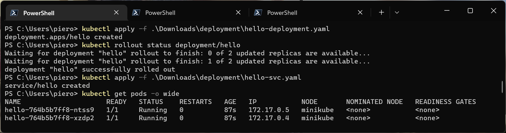

* Definición del objeto service en Kubernetes

En el servicio definimos que el app *hello* utilice externamente el puero 31000 para redirigir el tráfico internamente al puerto 80.

```
---
apiVersion: v1
kind: Service
metadata:
  name: hello
spec:
  type: NodePort
  selector:
    app: hello
  ports:
    - protocol: TCP
      nodePort: 31000
      port: 80
      targetPort: http
```

* Ejecución de creación de servicio

```
kubectl apply -f hello-svc.yaml
minikube service list -p multinode-demo
```

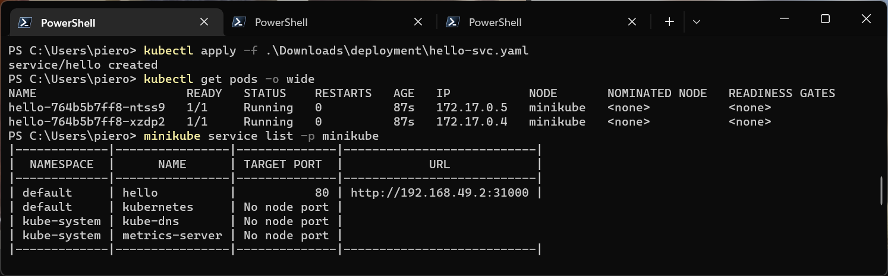

* Revisión del despliegue de POD's en multiples nodos del cluster
Como se puede apreciar en la salida del siguiente comando, el despliegue de los 2 pods se realizó en los 2 Nodos del cluster

```
kubectl get pods -A -o wide
```

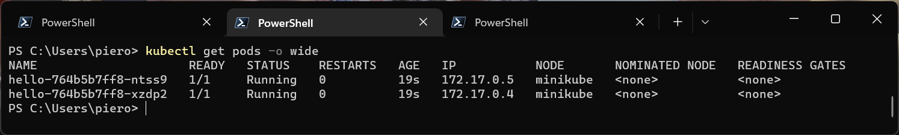

Para probar el funcionamiento, se ha ejecutado el comando service para abrir un 'túnel' que permita acceder al servicio desde el host local.

```
minikube service hello
```

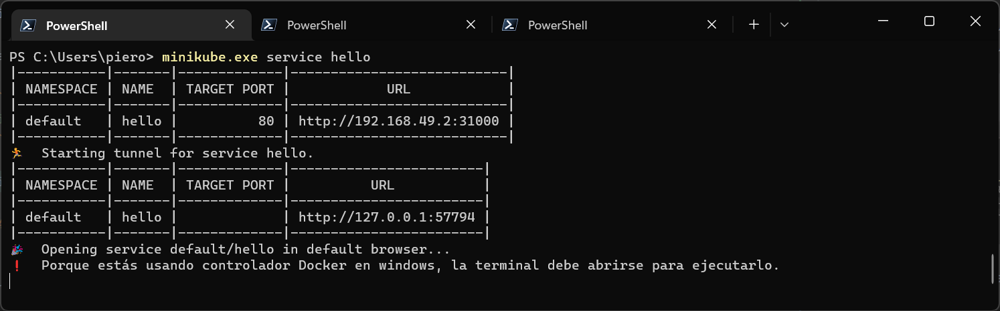

Y se comprueba el funcionamiento con el comando curl

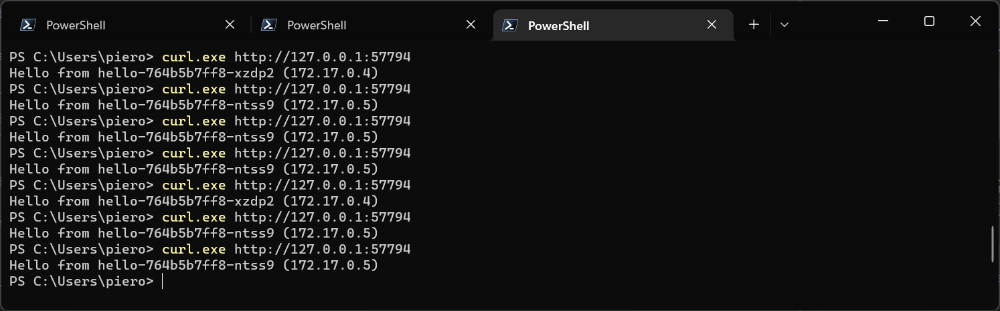

### b) Despliegue en cluster multi-node
* Definición del objeto deployment en Kubernetes

Creamos el siguiente archivo hello-deployment.yaml

```
---
apiVersion: apps/v1
kind: Deployment
metadata:
  name: hello
spec:
  replicas: 2
  strategy:
    type: RollingUpdate
    rollingUpdate:
      maxUnavailable: 100%
  selector:
    matchLabels:
      app: hello
  template:
    metadata:
      labels:
        app: hello
    spec:
      affinity:
        # ⬇⬇⬇ This ensures pods will land on separate hosts
        podAntiAffinity:
          requiredDuringSchedulingIgnoredDuringExecution:
          - labelSelector:
              matchExpressions: [{ key: app, operator: In, values: [hello] }]
            topologyKey: "kubernetes.io/hostname"
      containers:
      - name: hello-from
        image: pbitty/hello-from:latest
        ports:
          - name: http
            containerPort: 80
      terminationGracePeriodSeconds: 1
```
Destacamos de la definición del deployment los siguientes aspectos:

> * replicas: el valor de *2* muestra el número de réplicas a desplegar en el cluster
> * affinity: el valor *podAntiAffinity* nos asegura que las 2 pods se desplegerán en 2 nodos diferentes.

* Ejecución de creación de deployment

```
kubectl apply -f hello-deployment.yaml
```
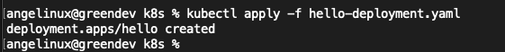

* Verificación del deployment

```
kubectl rollout status deployment/hello 
```

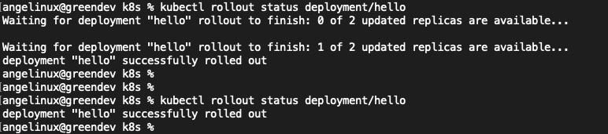


* Definición del objeto service en Kubernetes

En el servicio definimos que el app *hello* utilice externamente el puero 31000 para redirigir el tráfico internamente al puerto 80.

```
---
apiVersion: v1
kind: Service
metadata:
  name: hello
spec:
  type: NodePort
  selector:
    app: hello
  ports:
    - protocol: TCP
      nodePort: 31000
      port: 80
      targetPort: http 
```

* Ejecución de creación de servicio

```
kubectl apply -f hello-svc.yaml
minikube service list -p multinode-demo
```

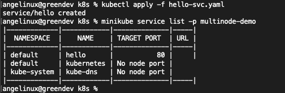

* Revisión del despliegue de POD's en multiples nodos del cluster
Como se puede apreciar en la salida del siguiente comando, el despliegue de los 2 pods se realizó en los 2 Nodos del cluster

```
kubectl get pods -A -o wide
```

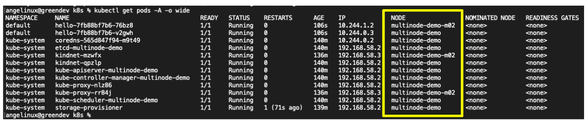


* Acceso y verificación del servicio

Podemos comprobar con la aplicación desplegada que la respusta que recibe el cliente proviene de diferentes containers que a su vez residen en diferentes PODS

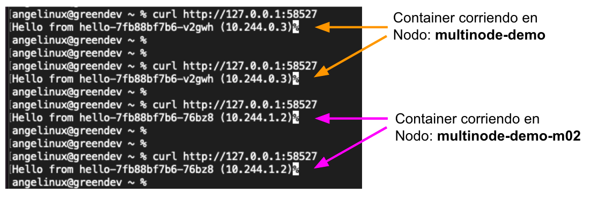

### 3.2 Descripción del flujo de la aplicación

### a) Flujo alto nivel
<figure>
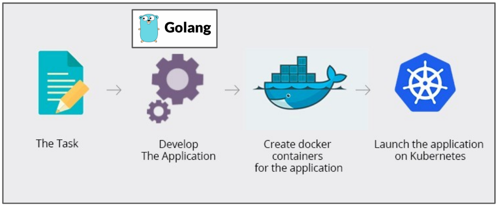
<figcaption align = "center"><b>Figure - Diagrama alto nivel</b></figcaption>
</figure>

### b) Flujo bajo nivel

<figure>
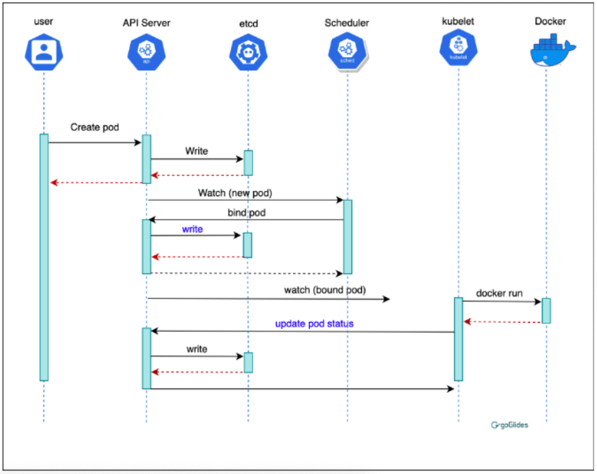
<figcaption align = "center"><b>Figure - Diagrama bajo nivel</b></figcaption>
</figure>
[Fuente: diagrama bajo nivel](https://blog.heptio.com/core-kubernetes-jazz-improv-over-orchestration-a7903ea92ca)